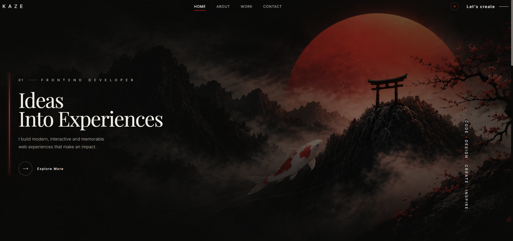

# KAZE — Creative Developer Portfolio

A dark, Japanese-inspired creative developer portfolio focused on clean design, cinematic visuals, smooth interactions, and modern frontend development.

KAZE — meaning **風 (wind)** in Japanese — combines minimalism, Japanese aesthetics, atmospheric imagery, and interactive web experiences into a unique portfolio concept.

## 🌐 Live Demo

## 🖼️ Preview



## ✨ Features

- Dark Japanese-inspired visual design
- Fully responsive layout
- Cinematic hero section
- Fixed animated navigation
- Active navigation based on scroll position
- Fullscreen mobile navigation
- Smooth section navigation
- Scroll reveal animations
- Animated skill progress bars
- Interactive project cards
- Hero parallax effect
- Atmospheric background artwork
- Responsive project showcase
- Contact section with social links
- Mobile, tablet and desktop support
- Reduced-motion accessibility support

## 🧩 Sections

### Home

Cinematic landing section introducing the portfolio and its visual identity.

### About

Developer introduction, creative philosophy, skills, and technical experience.

### Work

Selected frontend projects presented through interactive project cards.

### Contact

Contact information and social links integrated into a full-screen Japanese-inspired composition.

## 🛠️ Technologies

- HTML5
- CSS3
- Vanilla JavaScript
- Lucide Icons
- Intersection Observer API
- CSS Grid
- Flexbox
- CSS Custom Properties
- Responsive Design

## 🎨 Design

KAZE combines modern frontend design with Japanese visual influences such as:

- Enso-inspired circular artwork
- Japanese typography and symbols
- Red accent details
- Mountain landscapes
- Cherry blossoms
- Dark cinematic compositions
- Minimal typography
- Atmospheric textures

The interface was designed around a restrained color palette, strong typography, negative space, and subtle motion.

## ⚡ JavaScript Features

The project includes custom JavaScript for:

- Sticky header behavior
- Header scroll state
- Active navigation tracking
- Smooth scrolling
- Mobile menu controls
- Scroll reveal animations
- Skill bar animations
- Project card interactions
- Hero parallax movement
- Responsive interaction handling

## 📱 Responsive Design

KAZE is designed for multiple screen sizes and adapts its layout for:

- Desktop
- Laptop
- Tablet
- Mobile

Complex multi-column layouts transition into simplified mobile compositions while preserving the visual identity of the original design.

## 📂 Project Structure

```text
kaze-portfolio/
│
├── index.html
├── style.css
├── script.js
├── preview.png
│
├── images/
│   ├── home-img.png
│   ├── about-img.png
│   ├── about-bg.png
│   ├── project 1.png
│   ├── project 2.png
│   ├── project 3.png
│   ├── contact-img.png
│   └── contact-blossom-tree.png
│
├── README.md
└── LICENSE
```

## 🚀 Run Locally

Clone the repository:

```bash
git clone https://github.com/JohnYisBackk/kaze-portfolio.git
```

Open the project directory:

```bash
cd kaze-portfolio
```

Then open `index.html` in your browser or run the project using a local development server such as Live Server.

## 🎯 Project Purpose

KAZE was created as a frontend portfolio project focused on combining visual design with practical frontend development.

The project explores responsive layouts, CSS positioning, layered compositions, reusable styling, JavaScript interactions, and modern UI animation techniques.

## 📄 License

This project is licensed under the MIT License.

See the [LICENSE](LICENSE) file for details.

---

**KAZE — Code. Design. Motion.**
